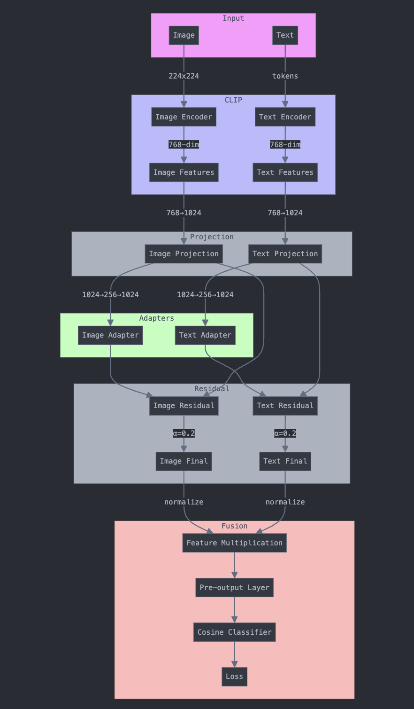

# MemeSense: A Multimodal Framework for Meme Analysis

## Table of Contents
1. [Overview](#overview)
2. [Dataset](#dataset)
3. [Architectural-Overview](#architectural-overview)
4. [Architectural Details](#architectural-details)
5. [Step-by-Step Data Flow](#step-by-step-data-flow)
6. [Classification Mechanism](#classification-mechanism)
7. [Training Process](#training-process)
8. [Evaluation](#evaluation)

## Overview
MemeSense is a multimodal framework that leverages OpenAI CLIP's pre-trained knowledge for Meme analysis. It supports multiple classification tasks:
- Humor Detection (Binary)
- Hate Speech Detection (Binary)
- Target Classification (4 classes)
- Stance Classification (3 classes)


## Dataset

Used PrideMM dataset, a collection of memes annotated for various tasks such as hate speech detection, target identification, stance classification, and humor recognition.

# Directory Organization
```
Data/
├── Images/
│   ├── meme1.jpg
│   ├── meme2.jpg
│   └── ...
├── checkpoints/
│   └── model.ckpt
└── PrideMM.csv
```
# Data Format

The `PrideMM.csv` file contains rich annotations with the following columns:

| Column | Description                                        |
|--------|----------------------------------------------------|
| name   | Image filename (str)                               |
| text   | Meme text content (str)                            |
| split  | Dataset split designation (str: 'train'/'val') |
| humour | Binary humor label (int: 0/1)                     |
| hate   | Binary hate speech label (int: 0/1)                |
| target | Target classification (int: 0-3)                   |
|        | - 0: No particular target                          |
|        | - 1: Individual                                    |
|        | - 2: Community                                     |
|        | - 3: Organization                                  |
| stance | Stance classification (int: 0-2)                   |
|        | - 0: Neutral                                       |
|        | - 1: Support                                       |
|        | - 2: Oppose                                        |

# Class Distribution

The PrideMM dataset consists of 5,063 samples for most tasks, with the following distribution:

### Hate Speech Classification

| Class     | Samples | Percentage |
|-----------|---------|------------|
| No Hate   | 2,581   | 50.97%     |
| Hate      | 2,482   | 49.03%     |

Nearly balanced distribution, indicating natural occurrence of hate speech in memes.

### Target Classification

*Note: Only includes 2,482 samples (subset where hate=1)*

| Class         | Samples | Percentage |
|---------------|---------|------------|
| Undirected    | 771     | 31.07%     |
| Individual    | 249     | 10.03%     |
| Community     | 1,164   | 46.90%     |
| Organization  | 298     | 12.00%     |

Shows significant imbalance, with community-targeted content being most prevalent.

### Stance Classification

| Class   | Samples | Percentage |
|---------|---------|------------|
| Neutral | 1,458   | 28.80%     |
| Support | 1,909   | 37.70%     |
| Oppose  | 1,696   | 33.50%     |

Relatively balanced tripartite distribution.

### Humor Classification

| Class     | Samples | Percentage |
|-----------|---------|------------|
| No Humor  | 1,642   | 32.43%     |
| Humor     | 3,421   | 67.57%     |

Notable imbalance favoring humorous content.

## Architectural Overview

Diagram illustrating a step-by-step data flow and key components of the architecture:



#### Key Components:

- **CLIP Encoders**: Processes the input image and text through separate encoders, converting them into uniform feature vectors.
- **Feature Projection**: Enhances the dimensionality of the initial features to prepare them for more complex transformations.
- **Adapters**: Modifies the projected features to fine-tune them towards specific tasks.
- **Residual Integration**: Combines the original and adapted features using a weighted approach to maintain both novelty and integrity of the pre-trained features.
- **Feature Fusion and Normalization**: Fuses and normalizes the image and text features to ensure they are on a comparable scale.
- **Cosine Classifier**: Utilizes the cosine similarity between the fused features and class weights to determine the class labels.
- **Loss Computation**: The final prediction step where the model's output is evaluated against true labels to compute the loss.


## Architectural Details

### Base Architecture: CLIP
- **Vision Encoder (ViT-L/14)**
  - Input: 224x224 RGB images
  - Output: 768-dimensional feature vectors
  - Structure: 24 transformer layers with attention

- **Text Encoder**
  - Input: Tokenized text (max 77 tokens)
  - Output: 768-dimensional feature vectors
  - Structure: 12 transformer layers

Both encoders are frozen to preserve CLIP's pre-trained knowledge.

### Architecture Components

#### 1. Linear Projection Layer
```
Purpose: Map CLIP features to higher dimension with configurable depth
Input: 768-dimensional features (cfg.unmapped_dim)
Output: 1024-dimensional features (cfg.map_dim)

Implementation:
Base Layer (Always present):
- Linear layer: 768 → 1024
- Dropout (p=drop_probs[0])

Additional Layers (if num_layers > 1):
For each extra layer:
- ReLU activation
- Linear layer: 1024 → 1024 (same dimension)
- Dropout (p=drop_probs[0])

Example with num_layers=2:
Input (768) 
→ Linear(768→1024) + Dropout 
→ ReLU → Linear(1024→1024) + Dropout 
→ Output (1024)

Configuration:
- num_layers: Controls depth of projection
- drop_probs: List of dropout probabilities
- Input/Output dimensions: Configurable through cfg
```

#### 2. Adapter Modules
```
Input: 1024-dimensional features (c_in)
Output: 1024-dimensional features (c_in)

Architecture:
Input (1024) 
→ Linear(1024→256, bias=False) [reduction=4: 1024/4=256]
→ ReLU(inplace=True)  
→ Linear(256→1024, bias=False)
→ ReLU(inplace=True)
→ Output (1024)

Key Features:
- Bottleneck reduction: Input dimension reduced by factor of 4
  Example: 1024 → 256 → 1024
- All linear layers have bias=False for efficiency
- Uses inplace ReLU operations to save memory
- Identical structure for both image and text adapters
- No residual connection in adapter itself (handled separately)

Parameters:
- c_in: Input/output dimension (1024 in our case)
- reduction: Bottleneck reduction factor (default=4)
```

#### 3. Residual Integration
```
Purpose: Balance adapter-processed features with original projected features
Ratio: α = 0.2 (cfg.ratio in code)

Process:
1. Image Feature Integration:
   image_features = 0.2 * image_adapted + 0.8 * image_projection
   where:
   - image_adapted: Output from img_adapter (1024-dim)
   - image_projection: Output from image_map (1024-dim)
   - 0.2 (α): Weight for adapted features
   - 0.8 (1-α): Weight for projected features

2. Text Feature Integration:
   text_features = 0.2 * text_adapted + 0.8 * text_projection
   where:
   - text_adapted: Output from text_adapter (1024-dim)
   - text_projection: Output from text_map (1024-dim)
   - Same ratio applied as image features

Why this matters:
- 20% contribution from adapted (task-specific) features
- 80% contribution from projected CLIP features
- Helps maintain CLIP's pre-trained knowledge while allowing adaptation
- Same ratio used for both modalities to maintain balance
- All features maintain 1024 dimensions throughout

Example:
If image_adapted = [0.5, 0.3, ..., 0.4]
and image_projection = [0.4, 0.2, ..., 0.3]
Then:
image_features = 0.2 * [0.5, 0.3, ..., 0.4] + 0.8 * [0.4, 0.2, ..., 0.3]
```

## Step-by-Step Data Flow

### 1. Initial Feature Extraction
```
Input Processing:
Image: 
- Input: RGB Image (batch_size, 3, 224, 224)
- CLIP Vision Transformer (ViT-L/14):
  * Conv2d layer (patch_size=14)
  * 24 transformer layers
  * Layer normalization
- Output: Image Features (batch_size, 768)

Text:
- Input: Text string 
- Tokenization: max 77 tokens
- CLIP Text Transformer:
  * Token embedding
  * 12 transformer layers
  * Layer normalization
- Output: Text Features (batch_size, 768)
```

### 2. Feature Projection (LinearProjection)
```
For both Image and Text features:
Input: (batch_size, 768)

Base transformation:
- Linear: 768 → 1024
- Dropout(p=drop_probs[0])

If num_mapping_layers > 1:
  For each additional layer:
  - ReLU
  - Linear: 1024 → 1024
  - Dropout(p=drop_probs[0])

Output: (batch_size, 1024)
```

### 3. Adapter Processing
```
For both modalities:
Input: Projected Features (batch_size, 1024)

Bottleneck transformation:
1. Dimension reduction:
   - Linear (bias=False): 1024 → 256
   - ReLU (inplace=True)
2. Dimension restoration:
   - Linear (bias=False): 256 → 1024
   - ReLU (inplace=True)

Output: Adapted Features (batch_size, 1024)

Purpose: Learn modality-specific adaptations while maintaining dimension
```

### 4. Residual Connection
```
For both modalities:
Input:
- Adapted Features (batch_size, 1024)
- Projected Features (batch_size, 1024)

Weighted combination:
Final = 0.2 * Adapted + 0.8 * Projected

Example for one feature:
Adapted: [0.5, 0.3, ..., 0.4]
Projected: [0.4, 0.2, ..., 0.3]
Final: 0.2 * [0.5, 0.3, ..., 0.4] + 0.8 * [0.4, 0.2, ..., 0.3]

Output: Balanced Features (batch_size, 1024)
```

### 5. Feature Normalization
```
For both modalities:
Input: Balanced Features (batch_size, 1024)

L2 Normalization:
Features_Normalized = Features / ||Features||₂
where ||Features||₂ = sqrt(sum(Features²))

Example:
Input: [0.2, 0.3, 0.4]
L2 norm = sqrt(0.2² + 0.3² + 0.4²) = 0.538
Normalized = [0.37, 0.56, 0.74]

Output: Normalized Features (batch_size, 1024)
Purpose: Ensure consistent feature magnitudes for similarity computation
```

### 6. Feature Fusion
```
Input:
- Normalized Image Features (batch_size, 1024)
- Normalized Text Features (batch_size, 1024)

Operation:
Fused_Features = Image_Features ⊙ Text_Features
(⊙ denotes element-wise multiplication)

Example for single position:
Image: [0.5, 0.3, ..., 0.4]
Text:  [0.6, 0.2, ..., 0.5]
Fused: [0.3, 0.06, ..., 0.2]

Output: Multimodal Features (batch_size, 1024)
Purpose: Create unified representation capturing both modalities
```

## Classification Mechanism

### 1. Semantic-Aware Weight Initialization
```
Purpose: Initialize classifier weights using CLIP's semantic understanding of classes

Process:
1. Template Creation:
   - Base template: "a photo of a {}."
   - For each class in cfg.class_names:
     * Replace underscores with spaces
     * Format into template
   
   Example (Humor Classification):
   Input classes: ['No Humor', 'Humor']
   Generated prompts: 
   - "a photo of a No Humor."
   - "a photo of a Humor."

2. Text Processing:
   - Tokenize prompts with CLIP tokenizer
   - Max context length: 77 tokens
   - Convert to device (cfg.device)
   Shape: (num_classes, 77)

3. Feature Extraction (with torch.no_grad()):
   a) Encode through CLIP text encoder:
      - Input: Tokenized prompts
      - Output: Text features (num_classes, 768)
   
   b) First normalization:
      - L2 normalize features along dim=-1
   
   c) Project through CLIP's visual projection:
      - text_features @ clip_model.visual.proj.t()
      - Aligns text features with visual space
   
   d) Second normalization:
      - L2 normalize again for consistent magnitudes
   
   e) Apply as classifier weights:
      - Final shape: (num_classes, 1024)
      - Used as initial weights for cosine classifier

Example Dimensions (Binary Classification):
- Input prompts: 2 strings
- Tokenized: (2, 77)
- CLIP features: (2, 768)
- Normalized & Projected: (2, 1024)
- Final classifier weights: (2, 1024)

Why this matters:
1. Leverages CLIP's pre-trained understanding of concepts
2. Creates semantically meaningful decision boundaries
3. Better initialization than random weights
4. Aligns with visual space through projection
5. Double normalization ensures stable similarity computations
```

### 2. Cosine Similarity Classification
```
Purpose: Compute class predictions using normalized cosine similarity with temperature scaling

Components:
1. Classifier Initialization:
   - Weight matrix: (num_classes × feat_dim)
   - Initially uniform random values in [-1, 1]
   - Renormalized with magnitude 1e-5
   - Later overwritten by semantic initialization

2. Forward Pass Process:
Input:
   - Features (x): (batch_size × 1024)
   - Weights (W): (num_classes × 1024)

Steps:
a) Feature Normalization:
   x_norm = x / ||x||₂
   - Applies L2 normalization along feat_dim
   - Ensures ||x_norm|| = 1

b) Weight Normalization:
   w_norm = weight / ||weight||₂
   - Applies L2 normalization along feat_dim
   - Ensures ||w_norm|| = 1

c) Similarity Computation:
   sim = F.linear(x_norm, w_norm)
   - Computes: x_norm · w_norm^T
   - Shape: (batch_size × num_classes)
   - Values range: [-1, 1]

d) Temperature Scaling:
   logits = sim * scale (where scale=30)
   - Sharpens probability distribution
   - Transforms [-1, 1] to [-30, 30]
   
Example Computation:
For batch_size=1, num_classes=2 (Humor):
1. Input feature: [0.5, 0.3, ..., 0.4]
2. Normalized feature: [0.4, 0.24, ..., 0.32]
3. Weight matrix:
   No Humor: [0.3, 0.2, ..., 0.1]
   Humor:    [0.4, 0.5, ..., 0.3]
4. Normalized weights:
   No Humor: [0.28, 0.19, ..., 0.09]
   Humor:    [0.37, 0.46, ..., 0.28]
5. Similarities:
   No Humor: 0.3
   Humor: 0.7
6. Scaled logits:
   No Humor: 0.3 * 30 = 9
   Humor: 0.7 * 30 = 21

Why This Approach:
1. Normalization makes comparison scale-invariant
2. Cosine similarity effective for semantic comparison
3. Temperature scaling (30) helps with:
   - Sharper probability distributions
   - More confident predictions
   - Better gradient flow during training
4. Compatible with semantic initialization
```

### Example Classification Flow
```
Let's consider a humor detection example

1. Get Fused Features:

   The model has processed the input image and text through the CLIP encoders, linear projection layers, adapter modules, residual integration, and feature normalization.
   The final output is a 1024-dimensional fused feature vector that captures information from both the visual and textual modalities. For instance fused feature vector is: [0.1, 0.3, ..., 0.2].

2. Compute Similarity with Class Weights:

   The model has a cosine classifier, where the class weights were initialized using CLIP's semantic understanding of the classes.
   For a binary humor classification task with classes "No Humor" and "Humor", the normalized class weight vectors might be:

   No Humor: [0.3, 0.2, ..., 0.1]
   Humor: [0.4, 0.5, ..., 0.3]


   The cosine similarity between the fused feature vector and each class weight vector is computed:

   Similarity with "No Humor" class: 0.3
   Similarity with "Humor" class: 0.7

3. Apply Temperature Scaling:

   The computed similarities are scaled by a temperature factor (e.g., 30) to sharpen the probability distribution:

   No Humor logit: 0.3 * 30 = 9.0
   Humor logit: 0.7 * 30 = 21.0

   After applying the temperature scaling, the next step in the classification flow would be to use the scaled logits for the cross-entropy loss calculation:

4. Use Logits for Cross-Entropy Loss:

   The scaled logits, representing the unnormalized log-probabilities for each class, are passed directly to the cross-entropy loss function, which computes the loss based on the ground truth labels.
   Loss = cross_entropy(logits, labels)
   The cross-entropy loss will handle the conversion of the logits to class probabilities internally, without the need to apply the softmax function explicitly.

   This  allows the model to optimize the classification task directly on the scaled logits, which have been sharpened by the temperature scaling to produce more confident predictions.

```

# Training Process

The MemeSense model contains a total of 3,675,136 parameters. The model was trained separately on each task: hate speech detection, target identification, stance classification, and humor recognition.

### Dataset
The dataset was split into training and validation sets:
- Training set: 4,666 images
- Validation set: 397 images

### Loss Function
The model was trained using Cross Entropy Loss with mean reduction, defined as:
```python
Loss = -log(P(correct_class))
```
### Training Details
- Total epochs: 10
- Batch size: 16
- Learning rate: 1e-4
- Weight decay: 1e-4

# Evaluation 

The model's performance was evaluated using the following metrics:
- Accuracy: The percentage of correctly classified samples.
- Area Under the Receiver Operating Characteristic curve (AUC): Measures the ability of the model to distinguish between classes. A higher AUC indicates better performance.
- F1 Score (macro-averaged): The harmonic mean of precision and recall, providing a balanced measure of the model's performance. The macro-average computes the metric independently for each class and then takes the average, treating all classes equally.

## Performance Metrics

The following table summarizes the performance of the MemeSense model on different tasks:

| Task                 | Accuracy | AUC     | F1 Score |
|----------------------|----------|---------|----------|
| Hate Speech Detection| 76.06%   | 84.52%  | 75.09%   |
| Target Identification| 66.12%   | 81.66%  | 58.65%   |
| Stance Classification| 62.00%   | 80.11%  | 57.98%   |
| Humor Recognition    | 80.27%   | 85.59%  | 77.21%   |


<!-- Would you like me to continue with:
1. Implementation details?
2. Configuration options?
3. Training procedures?
4. More detailed examples?

The README can be expanded further with technical details about batch processing, memory requirements, or specific task performance. Let me know what additional aspects you'd like me to cover. -->